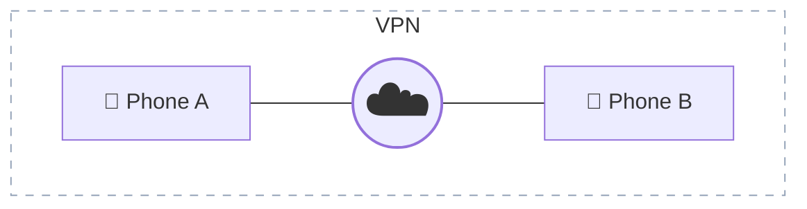
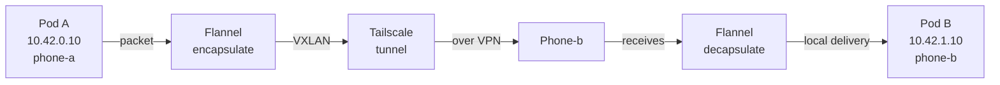
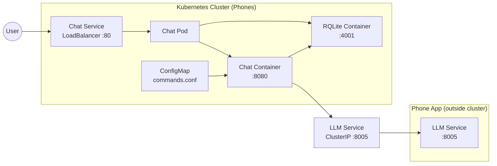

# Thank you!


---
layout: statement
---

# Wait? An <OrangeText>encore</OrangeText>?

---
layout: statement
---

# Let's add another <RedText>phone</RedText> 
# to the <OrangeText>cluster</OrangeText>

---
layout: statement
---

# But how can the <RedText>phones</RedText>
# <OrangeText>see</OrangeText> <BlueText>each other</BlueText>?

<!--
"When you have multiple nodes, they need to talk to each other.
The control plane needs to reach the worker nodes.
Pods need to communicate across nodes.

But here's the problem: these are mobile phones.
They might be on different WiFi networks, different mobile carriers.
They can't see each other."

Pause. Build tension.
-->

---

# Solution: A VPN

<div style=" text-align: center; margin-top: 2em;">

</div>

<div v-click class="mt-8 text-2xl text-center">
In our case: 
</div>

<!--
"The solution is a VPN - a virtual private network.
It makes all your devices appear as if they're on the same local network,
even if they're on opposite sides of the world.
No port forwarding or firewall changes needed, works across different physical networks and is encrypted for security.

For this demo, we're using Tailscale.
It's free for personal use, zero-config, and works great on Android."
-->

---

# What is Tailscale?

- Zero-config VPN based on WireGuard
- Mesh network - devices connect directly
- Free for personal use (up to 100 devices)
- Each device gets a stable IP address (100.x.x.x)

This is not an advertisement, just a great tool.

<!--
"Tailscale is a modern VPN that just works.
You install it, authenticate once, and your devices can talk to each other.

Each device gets a stable IP address in the 100.x.x.x range.
That's what we'll use for our cluster communication."
-->

<!--
# Setup Tailscale: UI Method

<PhoneTwoColumn
  :img="['./img/echo-demo/tailscale_install.png', './img/echo-demo/tailscale_auth.png', './img/echo-demo/tailscale_connected.png']"
>

You can also install via the Tailscale Android app:

1. Install from Google Play
2. Authenticate with your account
3. Grant VPN permissions

<div class="text-orange-400 font-bold mt-8">
For this demo, we'll use the terminal method instead
</div>

</PhoneTwoColumn>-->

<!--
"You can also install Tailscale through the Android app.
Install from Play Store, authenticate, grant permissions.

But for this demo, we're going to use the terminal method.
It's faster, more repeatable, and fits the theme."
-->

---

<CroppedImage src="./img/mn/tailscale-login.png" alt="Tailscale Login" />

---

<CroppedImage src="./img/mn/tailscale-token-gen.png" alt="Tailscale Token Generation" />

--- 

<CroppedImage src="./img/mn/tailscale-dashboard.png" alt="Tailscale Dashboard" />


---

<PhoneTwoColumnZoom
  img="./img/mn/setup_tailscale.png"
  :zoom="1"
  :offsetY="-387"
  :clickToReveal="true"
>

# Setup Tailscale

Prerequisites:
- Create `.tailscale-key` file with your Tailscale auth key

<br/>

<CodeWithScript scriptPath="./echo-demo/scripts/07-setup-tailscale.sh">
```bash
./echo-demo/scripts/07-setup-tailscale.sh phone-a
# Essentially:
curl -fsSL https://tailscale.com/install.sh | sh
sudo tailscale up --auth-key "$AUTH_KEY" --hostname "$HOSTNAME"
```
</CodeWithScript>

Installs Tailscale and connects with hostname `phone-a`.

</PhoneTwoColumnZoom>

<!--
"For the terminal method, you'll need a Tailscale auth key.
Create one in your Tailscale admin console.
Put it in a .tailscale-key file in the repo root.

Then run the script with the hostname you want - like phone-a.
It installs Tailscale and automatically connects using the auth key.

Much faster than the manual authentication flow."
-->

---
layout: statement
---

# Now let's <BlueText>join</BlueText>
# the <RedText>second phone</RedText>


---


<PhoneTwoColumnZoom
  img="./img/mn/setup-tailscale2.png"
  :zoom="1"
  :offsetY="-400"
>

# Setup Tailscale

1. Pull the GitHub repo on the second phone

```bash
sudo apt update; sudo apt install git curl
git clone https://github.com/parttimenerd/k3s-on-phone-demo
cd k3s-on-phone-demo
```
<v-click>

2. Create `.tailscale-key` file <br/>

</v-click>

<v-click>

3. Run the setup script with a different hostname:

```bash
./echo-demo/scripts/07-setup-tailscale.sh phone-b
```

Installs Tailscale and connects with hostname `phone-b`.

</v-click>

</PhoneTwoColumnZoom>

---

<CroppedImage src="./img/mn/tailscale-machines.png" alt="Tailscale Machines" />


---
layout: image
image: "./img/phone_in_closet.jpg"
---


---

<PhoneTwoColumnZoom
  img="./img/mn/join-cluster.png"
  :zoom="1"
  :offsetY="-401"
  :clickToReveal="true"
>

# Join Second Phone to Cluster

```bash{1|3-|3|4|5|6|7|all}
./echo-demo/scripts/08-join-cluster.sh
# Essentially:
curl -sfL https://get.k3s.io | \
  K3S_URL=https://$CONTROL_PLANE_HOSTNAME:6443 \
  K3S_TOKEN=$K3S_TOKEN K3S_NODE_NAME=$NODE_NAME \
  K3S_CLUSTER_CIDR=10.42.0.0/16 \
  INSTALL_K3S_EXEC="--flannel-iface=tailscale0" \
  sh -
```

<v-clicks>

*These settings also need to be on the control plane.*

<div class="text-sm text-orange-400 mt-4">
<strong>Security:</strong> Simple token is safe here because we're in a VPN.
</div>
</v-clicks>

</PhoneTwoColumnZoom>

<!--
Three critical settings:
- `K3S_CLUSTER_CIDR=10.42.0.0/16` — pod address space
- `--flannel-iface=tailscale0` — use Tailscale for tunneling
- `K3S_NODE_NAME=phone-b` — node identity
-->

---

# Why These Settings Matter

<div class="grid grid-cols-2 gap-6">

<div>

**`K3S_CLUSTER_CIDR=10.42.0.0/16`**

Without it:
- phone-a pods: `10.42.0.0/24`
- phone-b pods: `10.42.3.0/24` ❌

With it:
- Both use ranges from same `/16`
- Flannel can route between them ✓

</div>

<div>

**`--flannel-iface=tailscale0`**

Without it:
- Flannel uses WiFi/cellular
- Wrong interface for VPN ❌

With it:
- Flannel tunnels through VPN
- Pods talk via Tailscale ✓

</div>

</div>

<div class="mt-8 text-center">



</div>

<!--
"Let me explain what's actually happening here.

**What is Flannel?**
Flannel is k3s's Container Network Interface plugin - think of it as the postal service for pods across nodes. It creates an overlay network using VXLAN, which is basically encapsulation.

When a pod on phone-a wants to talk to a pod on phone-b, Flannel takes that packet and wraps it up - encapsulates it - so it can be sent over the physical network. The catch is: Flannel needs to know which physical node to send it to.

**Why K3S_CLUSTER_CIDR matters:**
Without it, each node independently assigns pod IP ranges. Phone-a might use 10.42.0.0/24 and phone-b gets 10.42.3.0/24 - completely different ranges with no coordination. Flannel can't build routes because it doesn't know which pod CIDRs belong to which node.

With K3S_CLUSTER_CIDR=10.42.0.0/16, we're telling both nodes: 'allocate your pod IPs from this /16 range.' Phone-a gets 10.42.0.0/24 as its sub-range, phone-b gets 10.42.1.0/24. Now Flannel knows: anything in 10.42.1.0/24 goes to phone-b.

**Why --flannel-iface=tailscale0 matters:**
Here's the subtle part: Flannel knows it needs to send packets to phone-b. But how? Over which interface? On a normal Kubernetes cluster, all nodes are on the same physical network - Flannel just sends the encapsulated packet on the main network interface.

But our nodes are on different phones. They might be on different WiFi networks, or cellular. The only connection between them is the Tailscale VPN tunnel - the tailscale0 interface.

Without --flannel-iface=tailscale0, Flannel auto-detects and tries to use eth0 or wlan0 - the WiFi or cellular interface. But phone-b isn't reachable there! The packet gets lost.

With --flannel-iface=tailscale0, we're telling Flannel: 'Use the Tailscale interface to tunnel encapsulated packets to remote nodes.' Now the VXLAN traffic goes through the VPN, and both phones can reach each other.

That's the magic of this setup: Flannel + Tailscale. Flannel handles the pod networking, Tailscale handles the VPN. Together, they give you a real Kubernetes cluster across phones."
-->

---


<PhoneTwoColumnZoom
  img="./img/mn/verify-cluster.png"
  :zoom="1"
  :offsetY="-30"
>

# Verify Multi-Node Cluster

<CodeWithScript scriptPath="./echo-demo/scripts/02-verify-cluster.sh">
```bash
kubectl get nodes
```
</CodeWithScript>

Shows all nodes in the cluster with their status.

*We could have named our nodes, but well...*

</PhoneTwoColumnZoom>

<!--
"Back on the control plane, let's verify both nodes are in the cluster.

You should see two nodes - phone-a as control plane, phone-b as worker.
Both should show STATUS: Ready."

Point at the screen. "This is a real multi-node Kubernetes cluster."
-->

---

<CroppedImage src="./img/mn/tailscale-dns.png" alt="Tailscale DNS" />

<!--
You might need to change the DNS, so that the docker registry can be resolved. 
Tailscale provides MagicDNS for this purpose, but it seems to fail.
-->
---


<PhoneTwoColumnZoom
  img="./img/mn/deploy_multi_node.png"
  :zoom="1"
  :offsetY="-30"
  :clickToReveal="true"
>

# Deploy Echo Server

<CodeWithScript scriptPath="./echo-demo/scripts/03-deploy-echo.sh">

```bash{all|1}
kubectl apply -f echo-demo/manifests/echo.yaml
kubectl wait --for=condition=ready \
  pod -l app=echo \
  --timeout=60s
kubectl get pods -o wide
```
</CodeWithScript>

Same deployment, but now Kubernetes can schedule pods on **both phones**.

</PhoneTwoColumnZoom>

<!--
"Let's deploy the echo server again.
Same script as before.
But now Kubernetes has two nodes to work with.

Watch as it schedules pods across both phones."
-->

---

<PhoneTwoColumnZoom
  img="./img/mn/curl.png"
  :zoom="2"
  :offsetY="-30"
  :clickToReveal="false"
>

# Cross-Node Load Balancing


<CodeWithScript scriptPath="./echo-demo/scripts/04c-curl-nodename.sh">
```bash
curl http://127.0.0.1:30080?echo_env_body=NODE_NAME
```
</CodeWithScript>


Notice how traffic is distributed across **different physical devices**.

</PhoneTwoColumnZoom>

<!--
"Now for the cool part.

This script makes several requests to the service.
But it asks for the NODE_NAME environment variable.

Watch as the responses come from different nodes.
That's Kubernetes load balancing traffic across two physical phones."

Click through slowly. Let each one sink in.
"phone-a... phone-b... phone-a again.

This is real distributed computing."
-->

---

<PhoneTwoColumnZoom
  img="./img/mn/delete.png"
  :zoom="1"
  :offsetY="-25"
>

# Remove Second Phone from Cluster


<CodeWithScript scriptPath="./echo-demo/scripts/09-delete-phone-b.sh">
```bash
kubectl drain "$NODE_NAME" \
  --ignore-daemonsets \
  --delete-emptydir-data --force
kubectl delete node "$NODE_NAME"
```
</CodeWithScript>

Drains and removes phone-b from the cluster.

After this, the cluster is back to a single node.

</PhoneTwoColumnZoom>

<!--
"Before we undeploy, let's remove phone-b from the cluster.

This drains the node first - moving any running pods to other nodes.
Then it deletes the node registration from the cluster.

Let me explain those flags:
- --ignore-daemonsets: DaemonSets are system pods that run on every node.
  We can't move them, so we tell kubectl to ignore them during the drain.
- --delete-emptydir-data: Some pods use temporary storage called emptyDir.
  This flag allows the drain to proceed by deleting that temporary data.
- --force: Sometimes pods aren't managed by a controller. Force lets us delete them anyway.

Now we're back to a single-node cluster, just like we started."
-->

---

<PhoneTwoColumnZoom
  img="./img/mn/undeploy.png"
  :zoom="1"
  :offsetY="-25"
>

# Cleanup: Undeploy

<CodeWithScript scriptPath="./echo-demo/scripts/06-undeploy-echo.sh">
```bash
kubectl delete -f echo-demo/manifests/echo.yaml
```
</CodeWithScript>

Removes the deployment and service from the cluster.

Both phones are now idle, ready for the next demo.

</PhoneTwoColumnZoom>

<!--
"And when we're done, we clean up.

Same undeploy script as before.
It removes the deployment and service from both phones.

The cluster is still running, both nodes are still connected.
But the echo pods are gone."
-->


---
layout: statement
---

# So, <RedText>yes</RedText>, you can build a
# <OrangeText>Kubernetes</OrangeText> <BlueText>cluster</BlueText>
# from <RedText>phones</RedText>

---
layout: statement
---

And now let's see how we can use this cluster to run LLMs at the edge.

---

# LLM on Phone: MediaPipe

<div class="text-3xl text-orange-400 font-bold mt-2">
Local LLM. On-device. No cloud.
</div>

We run a **local LLM directly on Android** using **Google’s MediaPipe**.

Why MediaPipe?
- **Designed for on-device inference**
- **Runs on CPU/GPU/NPU** without cloud calls
- **Easy to integrate** in an Android app

This is **fully local** — no API keys, no network latency.

---

# The App: AI Phone Server

<div class="text-3xl text-orange-400 font-bold mt-2">
Android app → local AI server
</div>

An Android app exposes AI capabilities via a tiny HTTP server.

Features:
- **LLMs** (Gemma 3n E2B IT, Llama 3.2, Qwen, TinyLlama)
- **Object detection** (MediaPipe EfficientDet Lite 2)
- **Device sensors** (orientation) + camera capture

Open-source: https://github.com/parttimenerd/local-android-ai

<div class="flex gap-8 mt-6 items-center">
  <div class="text-sm text-gray-400">
    Blog (how it works)
    
  </div>
  <div class="text-sm text-gray-400">
    Project
    
  </div>
</div>

---

# MediaPipe App Screens

<div class="grid grid-cols-2 gap-6 items-center">
  
  
</div>

<Caption>Source: mostlynerdless.de</Caption>

---

# The API (Port 8005)

<div class="text-3xl text-orange-400 font-bold mt-2">
Local HTTP API for pods to call
</div>

The app opens **localhost:8005** and provides REST endpoints.

<div class="flex gap-4 mt-3 justify-center">
  <Badge variant="blue">REST</Badge>
  <Badge variant="green">LOCAL</Badge>
  <Badge variant="orange">8005</Badge>
</div>

<div class="max-w-md mx-auto mt-4">
  <KeyValue>
    <template #key>Port</template>
    <template #value>8005</template>
  </KeyValue>
  <KeyValue>
    <template #key>Base URL</template>
    <template #value>http://localhost:8005</template>
  </KeyValue>
</div>

```bash
curl http://localhost:8005/help
curl -s http://localhost:8005/ai/text \
  -H 'Content-Type: application/json' \
  -d '{"prompt":"Write a short, nerdy poem","model":"gemma-3n-e2b-it"}'
```


<Callout variant="orange">
Camera endpoints require the app to be visible (Android privacy).
</Callout>

---

# Add the Second Phone (AI Cluster)

<PhoneTwoColumnZoom
  img="./img/echo-demo/setup_tailscale.png"
  :zoom="1"
  :offsetY="-30"
  :clickToReveal="true"
>

<CodeWithScript scriptPath="./echo-demo/scripts/07-setup-tailscale.sh">
```bash
./echo-demo/scripts/07-setup-tailscale.sh phone-a
```
</CodeWithScript>

Connect the phone to Tailscale so it can join the cluster.

</PhoneTwoColumnZoom>

---

<PhoneTwoColumnZoom
  img="./img/echo-demo/join_cluster.png"
  :zoom="1"
  :offsetY="-30"
  :clickToReveal="true"
>

# Join Second Phone

<CodeWithScript scriptPath="./echo-demo/scripts/08-join-cluster.sh">
```bash
./echo-demo/scripts/08-join-cluster.sh
```
</CodeWithScript>

The second phone joins as a worker node.

</PhoneTwoColumnZoom>

---

<PhoneTwoColumnZoom
  img="./img/curl.png"
  :zoom="1"
  :offsetY="-30"
  :clickToReveal="true"
>

# Test Chat App

<CodeWithScript scriptPath="./chat-demo/scripts/02-test-chat.sh">
```bash
./chat-demo/scripts/02-test-chat.sh
```
</CodeWithScript>

Verify the chat UI and health endpoint are reachable.

</PhoneTwoColumnZoom>

---

# Act 1 — The Goal

- Run a chat app inside the cluster
- Use rqlite as embedded DB (sidecar)
- Call the phone-hosted LLM via a Service
- Expose chat via a LoadBalancer

TODOs (screenshots):
- chat UI in browser
- kubectl get pods -o wide (chat + rqlite)
- kubectl get svc (chat + llm)

---

# Act 2 — Overview: chat.yaml (Sections Only)

```yaml
apiVersion: apps/v1
kind: Deployment
metadata: ...
spec:
  replicas: ...
  template:
    spec:
      containers:
        - name: rqlite
        - name: chat
      volumes: ...
      readinessProbe: ...
      livenessProbe: ...
---
apiVersion: v1
kind: Service
metadata: ...
spec:
  ports: ...
```

Just the **structure** — we’ll zoom in on each part next.

---

# Act 2 — The Wiring (Architecture)



---

# Act 2.2 — Exposing localhost:8005 (Simple)

We only need the **LLM on the same phone** as the chat pod.

Simplest option: **run the pod on that node and use `hostNetwork`**.
Then `localhost:8005` in the pod *is the phone’s localhost*.

```yaml
spec:
  nodeSelector:
    llm: "true"          # schedule on the LLM phone
  hostNetwork: true       # share node network namespace
  dnsPolicy: ClusterFirstWithHostNet
```

Result: pods call `http://localhost:8005/...` directly.

*(Service + Endpoints is only needed if LLM lives on a different node.)*

**What these lines mean:**
- `hostNetwork: true` → pod shares the phone’s network; `localhost` is the phone.
- `dnsPolicy: ClusterFirstWithHostNet` → keep Kubernetes DNS working with host networking.

---

# Act 2.1 — What Is a Sidecar?

A **sidecar** is a helper container that runs in the *same pod* as your app.

It shares:
- Network namespace (localhost)
- Volumes (shared files/data)
- Lifecycle (starts/stops with the pod)

In this demo, **rqlite** is the sidecar for the chat app.

---

# Act 3 — The Spec: ConfigMap

```yaml
apiVersion: v1
kind: ConfigMap
metadata:
  name: chat-commands
data:
  commands.conf: |
    whoami=echo "pod=${POD_NAME} node=${NODE_NAME}"
    llm=curl -s http://llm:8005/ai/text \
      -H 'Content-Type: application/json' \
      -d '{"prompt":"${ARG}","model":"gemma-3n-e2b-it"}'
```

Why a ConfigMap?
- Keeps command logic out of the container image
- Easy to edit and re-deploy without rebuilding
- Mounted as a file at `/config/commands.conf`

---

# Act 3 — The Spec: Deployment (Pods)

```yaml
kind: Deployment
metadata:
  name: chat
spec:
  replicas: 2
  template:
    spec:
      containers:
        - name: rqlite
          image: rqlite/rqlite:8.27.0
          args: ["-http-addr","0.0.0.0:4001", "-raft-addr","0.0.0.0:4002", "/rqlite/file/data"]
        - name: chat
          image: docker.io/parttimenerd/phone-chat:v1.0.0
          env:
            - name: RQLITE_JDBC_URL
              value: jdbc:rqlite:http://localhost:4001
            - name: COMMANDS_FILE
              value: /config/commands.conf
```

Key ideas:
- Two containers in one pod (app + embedded DB)
- Shared volume for rqlite data
- Env vars connect app → DB and ConfigMap

---

# Act 3 — The Spec: Volumes & Probes

```yaml
volumeMounts:
  - name: chat-data
    mountPath: /rqlite
  - name: chat-config
    mountPath: /config
readinessProbe:
  httpGet:
    path: /api/healthz
    port: 8080
livenessProbe:
  httpGet:
    path: /api/healthz
    port: 8080
```

- `chat-data` is an `emptyDir` shared by both containers
- `chat-config` mounts the ConfigMap as files
- Probes keep Kubernetes from sending traffic too early

---

# Act 3 — The Spec: Service

```yaml
apiVersion: v1
kind: Service
metadata:
  name: chat
spec:
  selector:
    app: chat
  ports:
    - name: http
      port: 80
      targetPort: 8080
```

This creates a stable endpoint for the chat pods.

---


<PhoneTwoColumnZoom img="./img/deploy.png" :clickToReveal=true>

# Act 4 — The Launch: Try Without Label (Fails)

<CodeWithScript scriptPath="./chat-demo/scripts/00-deploy-chat-no-label.sh">
```bash
kubectl apply -f chat-demo/manifests/chat-config.yaml
kubectl apply -f chat-demo/manifests/chat.yaml
kubectl get pods -l app=chat -o wide
```
</CodeWithScript>

Pods stay **Pending** because no node is labeled for LLM.

</PhoneTwoColumnZoom>

---

<PhoneTwoColumnZoom img="./img/deploy.png" :clickToReveal=true>

# Act 4 — The Launch: Label This Phone

<CodeWithScript scriptPath="./chat-demo/scripts/00-label-llm.sh">
```bash
kubectl label node $(hostname) llm=true --overwrite
kubectl get node $(hostname) --show-labels
```
</CodeWithScript>

Now the chat pod can be scheduled on the LLM phone.

</PhoneTwoColumnZoom>

---

<PhoneTwoColumnZoom img="./img/deploy.png" :clickToReveal=true>

# Act 4 — The Launch: Deploy (Works)

<CodeWithScript scriptPath="./chat-demo/scripts/01-deploy-chat.sh">
```bash
kubectl apply -f chat-demo/manifests/chat-config.yaml
kubectl apply -f chat-demo/manifests/chat.yaml
kubectl wait --for=condition=ready pod -l app=chat \
  --timeout=120s
```
</CodeWithScript>

Apply the ConfigMap first, then the Deployment and Service.

</PhoneTwoColumnZoom>

---

# Add the Second Phone (AI Cluster)

<PhoneTwoColumnZoom
  img="./img/echo-demo/setup_tailscale.png"
  :zoom="1"
  :offsetY="-30"
  :clickToReveal="true"
>

<CodeWithScript scriptPath="./echo-demo/scripts/07-setup-tailscale.sh">
```bash
./echo-demo/scripts/07-setup-tailscale.sh phone-a
```
</CodeWithScript>

Connect the phone to Tailscale so it can join the cluster.

</PhoneTwoColumnZoom>

---

<PhoneTwoColumnZoom
  img="./img/echo-demo/join_cluster.png"
  :zoom="1"
  :offsetY="-30"
  :clickToReveal="true"
>

# Join Second Phone

<CodeWithScript scriptPath="./echo-demo/scripts/08-join-cluster.sh">
```bash
./echo-demo/scripts/08-join-cluster.sh phone-a
```
</CodeWithScript>

The second phone joins as a worker node.

</PhoneTwoColumnZoom>

---

<PhoneTwoColumnZoom
  img="./img/echo-demo/verify_multi_node.png"
  :zoom="1"
  :offsetY="-30"
  :clickToReveal="true"
>

# Verify Multi-Node Cluster

<CodeWithScript scriptPath="./echo-demo/scripts/09-verify-multi-node.sh">
```bash
./echo-demo/scripts/09-verify-multi-node.sh
```
</CodeWithScript>

Now the AI cluster has two phones.

</PhoneTwoColumnZoom>

---

<PhoneTwoColumnZoom img="./img/undeploy.png" :clickToReveal=true>

# Act 4 — Cleanup: Unset LLM Label

<CodeWithScript scriptPath="./chat-demo/scripts/99-unset-llm-label.sh">
```bash
kubectl label node $(hostname) llm-
kubectl get node $(hostname) --show-labels
```
</CodeWithScript>

Reset the node after the demo.

</PhoneTwoColumnZoom>

---
