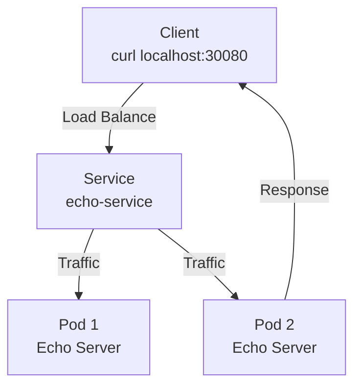
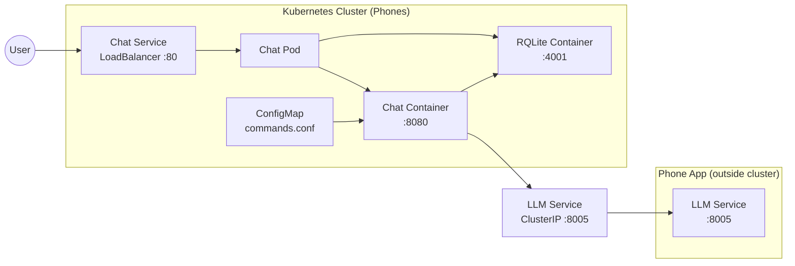

<script setup>
import qrMostly from './img/qr-mostlynerdless.png'
import qrSap from './img/qr-sapmachine.png'
import qrGithub from './img/qr-k3s-github.png'
</script>

<style>
:root {
  --code-font-size: 1.05rem;
  --code-line-height: 1.5;
  --code-bg: rgba(30, 41, 59, 0.92);
  --code-border: rgba(226, 232, 240, 0.5);
}

.slidev-slide pre,
.slidev-slide .shiki {
  font-size: var(--code-font-size);
  line-height: var(--code-line-height);
  background: var(--code-bg) !important;
  border: 1px solid var(--code-border);
  border-radius: 12px;
  padding: 16px 18px;
  box-shadow: 0 12px 24px rgba(15, 23, 42, 0.25);
}

.slidev-slide code {
  font-size: 0.95em;
}

.slidev-slide .shiki code {
  white-space: pre-wrap;
}

.slidev-slide pre code {
  font-weight: 500;
  color: #f8fafc;
}
</style>

# Kubernetes on a Phone

Running a multi-node cluster on Android devices

<div class="text-sm opacity-1">
Johannes Bechberger @ SAP SE
</div>

<!--
Take a deep breath. Smile. Make eye contact.
This is going to be fun.
-->

---
layout: center
---

# This Is Not a Joke

```sh
$ kubectl get nodes
NAME      STATUS   ROLES           AGE
phone-a   Ready    control-plane   30m
phone-b   Ready    <none>          10m
```

TODO: actual screenshot

<!--
<!--
Physically hold up the two phones.
Shock and awe. Make them lean forward.

Say slowly, with pauses:
"This is not a virtual machine.
This is not a Raspberry Pi.
This is my actual phone.
Running Kubernetes."

Pause for 3 seconds. Let it sink in.
-->

---

# What You'll See Today

- Multi-node Kubernetes cluster on Android phones
- VPN connecting them across networks
- Deploy apps, scale them, kill them
- Run an AI on one of them
- <span v-mark.orange="5">Learning the basics of Kubernetes along the way.</span>

<div class="text-sm mt-8">
<OrangeText><strong>Caveat:</strong> I'm not a Kubernetes expert. This is all for fun. Think of it as an extreme educational exercise.</OrangeText>
</div>

<!--
Confident. Slightly amused. You've done this before.

Pause before the last bullet.
"Today I'll show you how to run a multi-node Kubernetes cluster on Android phones,
connect them with a VPN, deploy apps, scale them, kill them,
and even run an AI on one of them."

Pause. "And if you understand what's happening today,
you understand Kubernetes."
-->

---

# Why Should You Care?

<div class="text-6xl font-bold text-center mt-12">
Kubernetes feels like magic
</div>

<!--
Build the case for why this matters.

"Kubernetes feels like magic to most people."

Pause. Let that sink in.
-->

---

# Why Should You Care?

<div class="text-6xl font-bold text-center mt-12">
Magic is intimidating
</div>

<!--
"And magic is intimidating.

When you don't understand how something works,
it's hard to trust it.
Hard to debug it.
Hard to use it effectively."
-->

---

# But on a Phone...

<div class="text-6xl font-bold text-center mt-8">
<OrangeText>You can see what's happening</OrangeText>
</div>

<v-clicks>

<div class="text-5xl text-center mt-8">
You can <span class="font-bold">touch</span> the nodes
</div>

<div class="text-4xl text-center mt-4">
You can <span class="font-bold">feel</span> them heat up under load
</div>

<div class="text-3xl text-center mt-4">
You can <span class="font-bold">watch</span> the battery drain
</div>

</v-clicks>

<!--
"But on a phone, everything changes.

You can SEE what's happening.

You can touch the nodes. Actually hold them in your hand.

You can feel them heat up when the CPU is busy.

You can watch the battery drain as containers start.

It makes Kubernetes real."
-->

---
layout: statement
---

# Let's have some fun, 
# shall we?

<!--
"Here's the key insight:

When you understand Kubernetes on a phone—
where you can see and touch everything—

You understand Kubernetes everywhere.

AWS. Google Cloud. Azure. On-premises.

The concepts are the same.
The only difference is you can't hold an EC2 instance in your hand."

Pause. Let them absorb this.
-->

---
layout: section
---

# But first, who am I?

---
layout: image
image: ./img/playfull_sapmachine.png
---

---
layout: section
---

# Part 1: The Hardware Story

Why phones can run Kubernetes


---
image: ./img/server.jpg
layout: image-left
---

# Remember 2010?

This was a production server:

- 4 CPU cores @ 2.4 GHz
- 4-8 GB DDR3 RAM
- 500 GB HDD (7200 RPM)
- <span v-mark.orange="5">It ran WordPress for 50,000 daily users</span>

<ImageAttribution>
By Victor Grigas - Own work, CC BY-SA 3.0
</ImageAttribution>

<!--
"In 2010, a typical production server looked like this.

Four cores. Eight gigs of RAM. A spinning disk.

And that server handled real workloads. Fifty thousand users a day."

Pause.

"Now look at what's in your pocket."
-->

---
layout: image-right
image: ./img/cover.jpg
---

# My somewhat modern phone (2024)

- 9 CPU cores (1x 3.0GHz Cortex-X3, 4x 2.45GHz A715, 4x 2.15GHz A510)
- ARM Mali-G715 MP7 GPU
- 12 GB LPDDR5X memory
- 256 GB UFS 4.0 storage (faster than SATA SSDs)
- <span v-mark.orange="5">More powerful than that 2010 server</span>

<!--
"A modern phone has nine cores—more than twice what that server had.
Faster RAM. Storage that's faster than SSDs from just a few years ago.

And it costs half as much."

Pause.

"Your phone is a server. You just use it for texting."
-->

---

# Phones Are Ridiculous Now

| Spec | 2010 Server | 2024 Phone | 2025 Phone |
|------|-------------|------------|------------|
| CPU Cores | 4 | <span class="text-orange-400 font-bold">9</span> | <span class="text-orange-400 font-bold">8</span> |
| CPU Speed | 2.4 GHz | <span class="text-orange-400 font-bold">3.0 GHz (prime core)</span> | <span class="text-orange-400 font-bold">4.47 GHz (Oryon L)</span> |
| RAM | 4-8 GB DDR3 | <span class="text-orange-400 font-bold">12 GB LPDDR5X</span> | <span class="text-orange-400 font-bold">12 GB LPDDR5X</span> |
| Storage | HDD (100 MB/s) | <span class="text-orange-400 font-bold">UFS 4.0 (4,000 MB/s)</span> | <span class="text-orange-400 font-bold">UFS 4.0 (4,000 MB/s)</span> |
| GPU | - | Mali-G715 MP7 | <span class="text-orange-400 font-bold">Adreno 830</span> |
| Process | 45nm+ | 4nm | <span class="text-orange-400 font-bold">3nm</span> |

<div v-click class="text-xl text-orange-400 font-bold mt-4">
2025 phones: 8 cores (2x 4.47 GHz + 6x 3.53 GHz Oryon), Samsung S25 Ultra
</div>

<!--
"Look at these numbers.

Storage is forty times faster.
CPUs are faster and more efficient.
RAM is faster and denser.

And yet we use this hardware to watch cat videos."

Pause for laughs.

"But if phones have server-grade hardware, can they run server software?"
-->

---
layout: statement
---

# They are the perfect 
# <span style="color: rgb(93, 60, 251)">IOT</span> device.

---

<div class="text-6xl font-bold text-center mt-8 text-orange-400">
It has everything you need
</div>

<v-clicks>

<div class="text-5xl text-center mt-8">
A <span class="font-bold">battery</span> to power it anywhere
</div>

<div class="text-4xl text-center mt-6">
A <span class="font-bold">screen</span> to interact with it directly
</div>

<div class="text-3xl text-center mt-5">
<span class="font-bold">Cellular connection</span> to stay online
</div>

<div class="text-3xl text-center mt-4">
And all this in a <span class="font-bold">readily available, compact</span> package.
</div>

</v-clicks>
---

# Geekbench

<div class="mt-8">

**Single-Core Performance:**

<div class="flex items-center gap-4 mt-4">
<div class="text-sm w-32">2010 Server</div>
<div class="bg-gray-600 h-8" style="width: 17.5%">350</div>
</div>

<div class="flex items-center gap-4 mt-2">
<div class="text-sm w-32 text-orange-400 font-bold">2024 Phone</div>
<div class="bg-orange-400 h-8" style="width: 64.4%">1288</div>
</div>

**Multi-Core Performance:**

<div class="flex items-center gap-4 mt-8">
<div class="text-sm w-32">2010 Server</div>
<div class="bg-gray-600 h-8" style="width: 24.7%">1112</div>
</div>

<div class="flex items-center gap-4 mt-2">
<div class="text-sm w-32 text-orange-400 font-bold">2024 Phone</div>
<div class="bg-orange-400 h-8" style="width: 75.3%">3393</div>
</div>

</div>

<div v-click class="text-2xl text-orange-400 font-bold mt-8 text-center">
Your pocket is more powerful than a 2010 data center
</div>

<!--
"These bars tell the story.

Single-core: The phone is nearly 4 times faster.
Multi-core: Over 3 times faster.

And this is comparing to a real production server.
The Dell PowerEdge M610 powered thousands of websites.

Now that power fits in your pocket."
-->

---

# PassMark

<div class="mt-8">

**Single-Thread Performance:**

<div class="flex items-center gap-4 mt-4">
<div class="text-sm w-32">2010 Server</div>
<div class="bg-gray-600 h-8" style="width: 28.3%">944</div>
</div>

<div class="flex items-center gap-4 mt-2">
<div class="text-sm w-32 text-orange-400 font-bold">2024 Phone</div>
<div class="bg-orange-400 h-8" style="width: 71.7%">2385</div>
</div>

**Multithread Performance:**

<div class="flex items-center gap-4 mt-8">
<div class="text-sm w-32">2010 Server</div>
<div class="bg-gray-600 h-8" style="width: 23.3%">2443</div>
</div>

<div class="flex items-center gap-4 mt-2">
<div class="text-sm w-32 text-orange-400 font-bold">2024 Phone</div>
<div class="bg-orange-400 h-8" style="width: 76.7%">8041</div>
</div>

</div>

<div v-click class="text-2xl text-orange-400 font-bold mt-8 text-center">
Every benchmark confirms it: phones have server-grade power
</div>

<!--
"Two different benchmarks. Same conclusion.

Geekbench: 3-4x faster.
PassMark: 2.5-3.3x faster.

Your phone is genuinely more powerful than a 2010 production server.

This isn't marketing. This is measured performance."
-->

---

# But Can Your Phone Run Kubernetes?

<div class="text-2xl font-bold mt-8">
If you have an iPhone: sorry
</div>

<!--
"First, let's address the elephant in the room.

This is Android-only.

iOS doesn't allow terminal emulators with package managers.
Apple's App Store guidelines prohibit running arbitrary code.
You can't access Linux kernel features.

So if you have an iPhone... sorry.

But if you have Android, keep watching."
-->

---

# But Can Android Run Kubernetes?

<v-clicks>

- Android runs on Linux
- Kubernetes runs on Linux
<div class="text-5xl text-orange-400 font-bold mt-4">So... yes?</div>

</v-clicks>

<!--
"Android is based on the Linux kernel.
Kubernetes runs on Linux.

So theoretically, yes.

But let's dig deeper."
-->

---
layout: section
---

# Part 2: The Software Story

Why Android can run Kubernetes

---

# What Does Kubernetes Need?

- **Namespaces** — Process isolation (PID, network, mount)
- **cgroups** — Resource limits (CPU, memory, I/O)
- **iptables** — Network routing and firewall
- **Overlay filesystem** — Layered container images

<!--
"Kubernetes needs four kernel features.

While Android's kernel has many of these,
running Kubernetes directly on Android is complex.

The solution: Run Debian inside Android via emulation.
Debian's environment is standard, tested, and reliable.

Kubernetes runs in Debian. Debian runs on Android. Simple."
-->

---

# Android Is Linux (But We Need Debian)

1. Android OS runs on Linux kernel
2. Use Linux Terminal App
3. Create emulated Debian environment
4. Install k3s inside Debian
5. Run your containers

<!--
"Android runs on the Linux kernel, but running Kubernetes directly on Android is tricky.

So we use an emulated Debian environment.

Via Linux Terminal App on Android 16+ (faster, more native).

Inside that Debian, Kubernetes runs normally."
-->

---
layout: center
---

<div class="text-6xl font-bold text-orange-400">
Demo Time!
</div>

<div class="text-2xl mt-8">
Let's see this Linux Terminal App for ourselves
</div>

<!--
"Enough theory. Let me show you what this looks like.

I'm going to open the Linux Terminal app on my phone.

Watch the screen."
-->

---

<PhoneTwoColumn img="./img/initial_terminal.png">

# How to Install Linux Terminal App

<div class="text-sm mt-4">
For Android 15+ (Google Pixel devices)
</div>

**Step 1: Enable Developer Options**
- Go to Settings → About Phone
- Tap "Build number" seven times

**Step 2: Enable Linux Development Environment**
- Go to Settings → System → Developer Options
- Find "Linux development environment, toggle it **On**

**Step 3: Install the Terminal**
- Find the Terminal app launcher
- Tap to install (~500 MB download)

</PhoneTwoColumn>

<!--
"If you want to try this yourself, here's how.

First, enable developer options by tapping build number seven times.
Yes, seven times. Google has a sense of humor.

Then enable the Linux development environment in developer settings.

Finally, install the terminal app. It downloads about 500 MB.

And you're done. You have a real Linux terminal on your phone."
-->

---
layout: statement
---
# Let's take a look

---

<PhoneTwoColumn img="./img/linux_terminal_error.png">

# Linux Terminal App Performance


Even the "fast" option has limitations:

<v-clicks>

- **PassMark Multithread CPU**: 3629 (vs 8041 native)
- **Memory Access**: Only 2GB (vs 12GB total)
- **Reason**: VM overhead and resource isolation

<div class="text-orange-400 font-bold text-2xl mt-8">
Still 1.5x faster than the 2010 server! (2443)
</div>

<div class="text-sm mt-4 text-gray-400">
For comparison: Mac M4 Pro (12 cores) scores 32,751 multithread, 4,563 single thread
</div>

<div class="text-orange-400 font-bold mt-4">
Not desktop-fast, but fast enough for edge computing
</div>

</v-clicks>

</PhoneTwoColumn>

<!--
"The Linux Terminal App is faster than proot, but it's not native performance.

The VM has overhead. Resource limits. Isolation.

Your PassMark score drops from 8041 to 3629.
You only get access to 2GB of memory, not the full 12GB.

But here's the key insight:
Even with these limitations, it's STILL faster than that 2010 production server.

This is a phone running a VM, and it beats a data center machine from 2010.

Now, is it as fast as a modern laptop? No. 
My Mac M4 Pro scores over 32,000 on PassMark multithread.
That's 9 times faster than the phone.

But for edge computing? For learning Kubernetes?
The phone is fast enough.

That's what matters."
-->

---
layout: image-left
image: ./img/k3s.png
backgroundSize: 60%
---

# k3s: Kubernetes for Edge

<div class="mt-6 mx-auto max-w-3xl text-left">
  <div class="text-2xl italic leading-relaxed text-gray-600 border-l-4 border-orange-400 pl-6">
    “K3s is a highly available, certified Kubernetes distribution designed for production workloads in unattended, resource-constrained, remote locations or inside IoT appliances.”
  </div>
  <div class="mt-4 text-sm text-gray-400 text-right">
    — K3s documentation
  </div>
</div>

<!--
"k3s is a lightweight Kubernetes.

Same API. Same concepts. Same kubectl.
But optimized for edge devices.

Single binary. Embedded database.

It's designed for devices exactly like phones."
-->

---

# So Can Phones Run Kubernetes?


<v-clicks>

- **Hardware?** <span class="text-orange-400 font-bold">More powerful than 2010 servers</span>
- **Environment?** <span class="text-orange-400 font-bold">Debian (emulated on Android)</span>
- **Software?** <span class="text-orange-400 font-bold">k3s in Debian</span>

<div class="text-6xl text-orange-400 font-bold mt-8">
Yes<BlueText>*</BlueText><RedText>*</RedText>.


</div>

<div class="text-2xl text-blue-700 font-bold mt-10">
for educational experiments
</div>
<div class="text-2xl text-red-700 font-bold mt-10">on Pixel phones (for now)</div>

</v-clicks>

<!--
"Hardware? Check.
Linux environment? Check.
Kubernetes? Check.

Phones can run Kubernetes.

Now let me show you how."
-->

---
layout: section
---

# Part 3: Understanding Kubernetes

5 Concepts. That's all you need.

<!--
IMPORTANT: No deep dives. No etcd. No API servers.
Only what you need to understand the demo.

"Before we start the demos, you need to understand five concepts.
Not twenty. Not fifty. Five.

After this, everything else is just details."
-->

---
layout: image-left
image: ./img/kubernetes_logo.svg
backgroundSize: 90%
---

# Kubernetes in One Sentence:

<div class="text-3xl text-orange-400 font-bold">
"Tell Kubernetes what you want, and it makes it happen."
</div>

<div v-click class="text-sm mt-4">
That's it. Everything else is implementation details.
</div>

<!--
"Kubernetes is declarative orchestration.

You declare what you want.
Kubernetes figures out how to do it.

You say: 'I want three copies of this app running.'
Kubernetes says: 'Okay, I'll schedule them, monitor them, and restart them if they crash.'

Simple."
-->

---
layout: image-right
image: ./img/nodes.svg
backgroundSize: 90%
---

# Concept 1: Node

A (virtual) machine in the cluster

<div class="text-sm">In our case: <code>phone-a</code>, <code>phone-b</code></div>

<v-clicks>

<div class="text-sm mt-4">
Could be a server in AWS.<br>
Could be a Raspberry Pi in your closet.<br>
Could be a phone in your pocket.
</div>

<div class="text-orange-400 font-bold">
Kubernetes doesn't care <br/>
what the hardware is
</div>

</v-clicks>

<!--
"A node is just a Linux machine that's joined a cluster.

Kubernetes treats all nodes the same.

Phone. Server. VM. Doesn't matter.

If it runs Linux and has the kernel features, it's a node."
-->

<ImageAttribution>
Kubernetes Documentation
</ImageAttribution>

---
image: ./img/phone_in_closet.jpg
layout: image-left
---

# Nodes are just a compute resource.

And this is a phone in my closet

---
layout: image-right
image: ./img/nodes.svg
backgroundSize: 90%
---

# Concept 2: Pod

Smallest deployable unit. Usually wraps one container.

```
Pod: echo-abc123
  └─ Container: ealen/echo-server
     └─ Process: HTTP server on port 80
```

<div class="text-sm mt-4">
Think of it as: <span class="text-orange-400 font-bold">Container + Kubernetes metadata</span>
</div>

<!--
"A Pod is a container with a Kubernetes passport.

The container runs your app.
The Pod is what Kubernetes schedules and tracks.

One sentence: That's all they need."
-->

<ImageAttribution>
Kubernetes Documentation
</ImageAttribution>

---
layout: image-right
image: ./img/deployment.png
backgroundSize: 90%
---

# Concept 3: Deployment

Declares desired state. "I want 3 of these running."

```yaml
apiVersion: apps/v1
kind: Deployment
metadata:
  name: echo
spec:
  replicas: 3
  selector:
    matchLabels:
      app: echo
  template:
    metadata:
      labels:
        app: echo
    spec:
      containers:
      - name: echo
        image: ealen/echo-server
        ports:
        - containerPort: 80
```

<!--
"You tell Kubernetes what you want.
You don't tell it HOW to do it.
You say 'I want 3 replicas of this app.'
Kubernetes figures out the rest."

"If one crashes, Kubernetes notices and creates a new one. Automatically."
-->

<ImageAttribution>
Kubernetes Documentation
</ImageAttribution>

---

# The Magic of Reconciliation

<div>

Kubernetes constantly checks:

<v-clicks>

- **Desired state:** What you said you want (3 replicas)
- **Current state:** What actually exists (maybe only 2 running)
- <span class="text-orange-400 font-bold">**Action:**</span> Fix the difference (create 1 more)

<div class="mt-4">This happens automatically, forever</div>

</v-clicks>

</div>

<!--
"This is the core of Kubernetes.

It compares what you want with what exists.
If they don't match, it fixes the difference.

You delete a Pod? Kubernetes creates a new one.
A node dies? Kubernetes reschedules the Pods elsewhere.

This is reconciliation. It's automatic self-healing."
-->

---
layout: default
---

# Concept 4: Service

A stable network address for Pods

<div class="text-center">
<svg viewBox="-20 0 700 400" class="mx-auto" style="max-width: 100%; height: 400px;">
  <defs>
    <style>
      .packet {
        fill: #10b981;
        filter: drop-shadow(0 0 4px rgba(16, 185, 129, 0.8));
      }
    </style>
    <marker id="arrowhead" markerWidth="10" markerHeight="10" refX="9" refY="3" orient="auto">
      <polygon points="0 0, 10 3, 0 6" fill="#666" />
    </marker>
  </defs>
  
  <!-- Internet Cloud -->
  <g>
    <text x="47" y="240" text-anchor="middle" fill="#6366f1" font-size="30" font-weight="bold">☁️</text>
  </g>
  
  <!-- Arrow to Service -->
  <path d="M 100 200 L 210 200" stroke="#999" stroke-width="2" fill="none" marker-end="url(#arrowhead)"/>
  
  <!-- Service -->
  <rect x="210" y="130" width="170" height="140" fill="#f97316" stroke="#c2410c" stroke-width="2" rx="10"/>
  <text x="295" y="175" text-anchor="middle" fill="white" font-size="11" font-weight="bold">Service</text>
  <text x="295" y="220" text-anchor="middle" fill="white" font-size="8">10.0.0.1:80</text>
  
  <!-- Arrows to Pods -->
  <path d="M 380 155 L 470 95" stroke="#10b981" stroke-width="2" fill="none" marker-end="url(#arrowhead)" stroke-dasharray="5,5" opacity="0.6"/>
  <path d="M 380 245 L 470 305" stroke="#10b981" stroke-width="2" fill="none" marker-end="url(#arrowhead)" stroke-dasharray="5,5" opacity="0.6"/>
  
  <!-- Pods (much bigger) -->
  <rect x="470" y="40" width="150" height="70" fill="#8b5cf6" stroke="#6d28d9" stroke-width="2" rx="8"/>
  <text x="545" y="90" text-anchor="middle" fill="white" font-size="13" font-weight="bold">Pod 1</text>
  
  <rect x="470" y="290" width="150" height="70" fill="#8b5cf6" stroke="#6d28d9" stroke-width="2" rx="8"/>
  <text x="545" y="345" text-anchor="middle" fill="white" font-size="13" font-weight="bold">Pod 2</text>
  
  <!-- Animated packets on curved paths -->
  <!-- Packet 1 → Pod 2 -->
  <g>
    <animateMotion dur="2.5s" repeatCount="indefinite">
      <mpath href="#path-to-pod2-1"/>
    </animateMotion>
    <circle r="7" class="packet"/>
  </g>
  
  <!-- Packet 2 → Pod 1 -->
  <g>
    <animateMotion dur="2.5s" repeatCount="indefinite" begin="0.4s">
      <mpath href="#path-to-pod1-1"/>
    </animateMotion>
    <circle r="7" class="packet"/>
  </g>
  
  <!-- Packet 4 → Pod 1 -->
  <g>
  <animateMotion dur="4.5s" repeatCount="indefinite" begin="1.8s">
      <mpath href="#path-to-pod1-2"/>
    </animateMotion>
    <circle r="7" class="packet"/>
  </g>
  
  <!-- Packet 5 → Pod 2 -->
  <g>
    <animateMotion dur="2.5s" repeatCount="indefinite" begin="1.6s">
      <mpath href="#path-to-pod2-2"/>
    </animateMotion>
    <circle r="7" class="packet"/>
  </g>
  
  
  <!-- Invisible paths for motion -->
  <path id="path-to-pod1-1" d="M 100 200 Q 360 140 545 75" fill="none"/>
  <path id="path-to-pod2-1" d="M 100 200 Q 360 260 545 325" fill="none"/>
  <path id="path-to-pod1-2" d="M 100 200 Q 360 140 545 75" fill="none"/>
  <path id="path-to-pod2-2" d="M 100 200 Q 360 260 545 325" fill="none"/>
</svg>

</div>

<!--
"Pods change. They come and go.
But the Service is always there, at the same address.
Clients don't care which Pod handles their request.
They just call the Service."
-->

<!--
"Pods change. They come and go.
But the Service is always there, at the same address.
Clients don't care which Pod handles their request.
They just call the Service."
-->

---
layout: image-right
image: ./img/service.svg
backgroundSize: 90%
---

# Why Services Matter

Without Services:
- Pod dies → IP changes → app breaks
- You'd need to track every Pod's IP
- No load balancing

<div v-click>
<div class="text-orange-400 font-bold mt-4">
With Services:</div>

- Always the same IP
- Automatic load balancing
- Kubernetes handles the routing
</div>

<!--
"Services solve the stability problem.

Pods are ephemeral. They come and go.
Services are stable. They stay the same.

You call the Service. Kubernetes routes to a healthy Pod.

Simple."
-->

<ImageAttribution>
Kubernetes Documentation
</ImageAttribution>

---

# Concept 5: Scheduler

Decides which Node gets which Pod

<div class="grid grid-cols-2 gap-8">

<div>

Scheduler looks at:
- Which nodes have capacity?
- Which nodes match constraints? 
  - memory
  - CPU
  - labels
- How to balance the load?

</div>

<div v-click>
<strong>Task:</strong> Replicate three times

<strong>Decision:</strong>

<table class="mt-4">
<thead>
<tr>
<th>Pod</th>
<th>Node</th>
</tr>
</thead>
<tbody>
<tr>
<td>Pod 1</td>
<td class="text-orange-400 font-bold">phone-a</td>
</tr>
<tr>
<td>Pod 2</td>
<td class="text-orange-400 font-bold">phone-b</td>
</tr>
<tr>
<td>Pod 3</td>
<td class="text-orange-400 font-bold">phone-a</td>
</tr>
</tbody>
</table>

</div>

</div>

<!--
"The scheduler is basically the cluster's traffic cop.
It looks at your Pods and your Nodes and says
'you go here, you go there.'"

Pause.

"That's it. That's Kubernetes."

Tone: Confident. You just explained Kubernetes in 4 minutes.
-->

---
layout: section
---

# YAML files galore

All this is configured by a few YAML files and the `kubectl` command-line tool.

---
layout: section
---

# Wrap up

---

<div class="text-6xl font-bold text-center mt-8 text-orange-400">
Thats everything you need
</div>

<v-clicks>

<div class="text-5xl text-center mt-8">
The <span class="font-bold text-blue-400">hardware</span> changes
</div>

<div class="text-4xl text-center mt-6">
The <span class="font-bold text-blue-400">tooling</span> changes
</div>

<div class="text-3xl text-center mt-5">
But the <span class="font-bold text-blue-400">concepts</span> stay the same
</div>

<div class="text-3xl text-orange-600 text-center mt-4">
Nodes. Pods. Services. Scheduling.
</div>

<div class="text-3xl text-center mt-6">
This is <span class="font-bold text-blue-400">Kubernetes</span> in a nutshell</div>
</v-clicks>

---
layout: statement
---

# But enough with the <span class="text-blue-400">theory</span>. Let's see it in <OrangeText>action</OrangeText>.

---
layout: section
---

# Part 4: A tiny k3s cluster 
# in your pocket

---
layout: section
---

# k3s: Setup & First App

From empty phone to running Kubernetes

---
---

# What we want

**Echo Server**: A simple HTTP server that echoes back request details ([ealenn.github.io/Echo-Server](https://ealenn.github.io/Echo-Server/))

We deploy:
- Two Echo pods behind a Kubernetes Service
- Service load-balances traffic between the pods

```bash
curl http://localhost:3000?echo_code=404
-> HTTP/1.1 404 Not Found
```

Response shows which pod handled the request

---

# Echo Architecture

<div class="text-center">

</div>

---

<PhoneTwoColumn img="./img/git_clone.png">

# Download the repo

Follow along on your device:

```bash
sudo apt update; sudo apt install git
git clone https://github.com/parttimenerd/k3s-on-phone-demo
cd k3s-on-phone-demo
```

{width=200px}

*Scan to clone*

All demo files for this demo live in **echo-demo/**

<!--
"Change one number. Kubernetes does the rest.
That's the core idea."
-->
</PhoneTwoColumn>

---

<PhoneTwoColumn :img="['./img/k3s_install2.png', './img/k3s_install.png']">

# Install k3s

<CodeWithScript scriptPath="./echo-demo/scripts/01-install-k3s.sh">
```bash
curl -sfL https://get.k3s.io | K3S_TOKEN=abc sh -
```
</CodeWithScript>

This creates a **single-node cluster** with:
- Control plane (API server, scheduler, controller)
- Container runtime
- kubectl CLI
- Simple token `abc` for joining nodes

<div class="text-sm text-orange-400 mt-4">
<strong>Note:</strong> Simple tokens like "abc" are ONLY acceptable in a VPN. Never in production!
</div>

The service auto-restarts on reboot or crash.

</PhoneTwoColumn>

<!--
"Now let's install Kubernetes.

The beauty of k3s is that it's just one command.

We're setting a simple token 'abc' so joining the second phone is easy.
This is only acceptable because we're in a Tailscale VPN.
In production, you'd use the auto-generated secure token.

This command downloads and installs k3s as a system service.
It sets up everything you need: the API server, the scheduler, the kubelet, the container runtime.

After this finishes, you'll have a fully functional Kubernetes cluster.
A single-node cluster, but fully functional.

No additional setup. No manual configuration.

Just one command, and Kubernetes is running."
-->

---

<PhoneTwoColumnZoom img="./img/verify_cluster.png" :offsetY="-109">

# Verify the Cluster

<CodeWithScript scriptPath="./echo-demo/scripts/02-verify-cluster.sh">
```bash
kubectl get nodes
```
</CodeWithScript>

Your cluster is ready! You should see:
- **STATUS**: Ready
- **ROLES**: control-plane
- **AGE**: How long k3s has been running

One command. One node. Full Kubernetes.

</PhoneTwoColumnZoom>

---

# Deploy Echo Server

<div class="grid grid-cols-2 gap-4 text-sm">

<div>

```yaml
apiVersion: apps/v1
kind: Deployment
metadata:
  name: echo
  labels:
    app: echo
spec:
  replicas: 2
  selector:
    matchLabels:
      app: echo
  template:
    metadata:
      labels:
        app: echo
    spec:
      containers:
        - name: echo
          image: ealen/echo-server:0.9.2
          ports:
            - containerPort: 80
```

</div>

<div style="margin-top: -60px;">

```yaml
          env:
            - name: POD_NAME
              valueFrom:
                fieldRef:
                  fieldPath: metadata.name
            - name: NODE_NAME
              valueFrom:
                fieldRef:
                  fieldPath: spec.nodeName
            - name: TEXT
              value: echo
---
apiVersion: v1
kind: Service
metadata:
  name: echo
  labels:
    app: echo
spec:
  type: LoadBalancer
  selector:
    app: echo
  ports:
    - name: http
      port: 80
      targetPort: 80
```

</div>

</div>

---

<PhoneTwoColumnZoom img="./img/deploy.png" :clickToReveal=true>

# Run the Deployment

<CodeWithScript scriptPath="./echo-demo/scripts/03-deploy-echo.sh">
```bash
kubectl apply -f echo-demo/manifests/echo.yaml
kubectl wait --for=condition=ready pod -l app=echo \
  --timeout=60s
kubectl get pods -o wide
```
</CodeWithScript>

This script:
1. Applies the deployment and service
2. Waits for all pods to be ready
3. Shows the running pods

The service automatically sets up a LoadBalancer endpoint.

</PhoneTwoColumnZoom>

---

<PhoneTwoColumnZoom img="./img/curl.png">

# Test the Service

<CodeWithScript scriptPath="./echo-demo/scripts/04-curl.sh">
```bash
curl http://localhost:3000?echo_code=402
```
</CodeWithScript>

The service responds with details about which pod handled the request.

</PhoneTwoColumnZoom>

---

<PhoneTwoColumnZoom img="./img/scale.png">

# Scale the Deployment

<CodeWithScript scriptPath="./echo-demo/scripts/05-scale-echo.sh">
```bash
kubectl scale deployment echo --replicas=3
```
</CodeWithScript>

Alternative: You could also modify the YAML and redeploy:

```yaml
spec:
  replicas: 3
```

Then run `kubectl apply -f echo-demo/manifests/echo.yaml`

Scaling is instant. Kubernetes automatically schedules the new pod.

</PhoneTwoColumnZoom>

---

<PhoneTwoColumnZoom :img="['./img/curl_result_1.png', './img/curl_result_2.png', './img/curl_result_3.png']" :clickToReveal="false" :zoom="2" :offsetY="-50">

# Load Balancing in Action

Kubernetes distributes traffic across all available replicas **because of the Service** (the `LoadBalancer` type just exposes it externally).


<div class="text-center">
<svg viewBox="-20 0 700 400" class="mx-auto" style="max-width: 100%; height: 400px;">
  <defs>
    <style>
      .packet {
        fill: #10b981;
        filter: drop-shadow(0 0 4px rgba(16, 185, 129, 0.8));
      }
    </style>
    <marker id="arrowhead" markerWidth="10" markerHeight="10" refX="9" refY="3" orient="auto">
      <polygon points="0 0, 10 3, 0 6" fill="#666" />
    </marker>
  </defs>
  
  <!-- Internet Cloud -->
  <g>
    <text x="47" y="240" text-anchor="middle" fill="#6366f1" font-size="30" font-weight="bold">☁️</text>
  </g>
  
  <!-- Arrow to Service -->
  <path d="M 100 200 L 210 200" stroke="#999" stroke-width="2" fill="none" marker-end="url(#arrowhead)"/>
  
  <!-- Service -->
  <rect x="210" y="130" width="170" height="140" fill="#f97316" stroke="#c2410c" stroke-width="2" rx="10"/>
  <text x="295" y="175" text-anchor="middle" fill="white" font-size="11" font-weight="bold">Service</text>
  <text x="295" y="220" text-anchor="middle" fill="white" font-size="8">10.0.0.1:80</text>
  
  <!-- Arrows to Pods -->
  <path d="M 380 155 L 470 95" stroke="#10b981" stroke-width="2" fill="none" marker-end="url(#arrowhead)" stroke-dasharray="5,5" opacity="0.6"/>
  <path d="M 380 245 L 470 305" stroke="#10b981" stroke-width="2" fill="none" marker-end="url(#arrowhead)" stroke-dasharray="5,5" opacity="0.6"/>
  
  <!-- Pods (much bigger) -->
  <rect x="470" y="40" width="150" height="70" fill="#8b5cf6" stroke="#6d28d9" stroke-width="2" rx="8"/>
  <text x="545" y="90" text-anchor="middle" fill="white" font-size="13" font-weight="bold">Pod 1</text>
  
  <rect x="470" y="290" width="150" height="70" fill="#8b5cf6" stroke="#6d28d9" stroke-width="2" rx="8"/>
  <text x="545" y="345" text-anchor="middle" fill="white" font-size="13" font-weight="bold">Pod 2</text>
  
  
  <!-- Animated packets on curved paths -->
  <!-- Packet 1 → Pod 2 -->
  <g>
    <animateMotion dur="2.5s" repeatCount="indefinite">
      <mpath href="#path-to-pod2-1"/>
    </animateMotion>
    <circle r="7" class="packet"/>
  </g>
  
  <!-- Packet 2 → Pod 1 -->
  <g>
    <animateMotion dur="2.5s" repeatCount="indefinite" begin="0.4s">
      <mpath href="#path-to-pod1-1"/>
    </animateMotion>
    <circle r="7" class="packet"/>
  </g>
  
  <!-- Packet 4 → Pod 1 -->
  <g>
    <animateMotion dur="2.5s" repeatCount="indefinite" begin="1.2s">
      <mpath href="#path-to-pod1-2"/>
    </animateMotion>
    <circle r="7" class="packet"/>
  </g>
  
  <!-- Packet 5 → Pod 2 -->
  <g>
  <animateMotion dur="4.5s" repeatCount="indefinite" begin="2.4s">
      <mpath href="#path-to-pod2-2"/>
    </animateMotion>
    <circle r="7" class="packet"/>
  </g>
  
  
  <!-- Invisible paths for motion -->
  <path id="path-to-pod1-1" d="M 100 200 Q 360 140 545 75" fill="none"/>
  <path id="path-to-pod2-1" d="M 100 200 Q 360 260 545 325" fill="none"/>
  <path id="path-to-pod1-2" d="M 100 200 Q 360 140 545 75" fill="none"/>
  <path id="path-to-pod2-2" d="M 100 200 Q 360 260 545 325" fill="none"/>
</svg>

</div>

</PhoneTwoColumnZoom>

---

<PhoneTwoColumnZoom img="./img/undeploy.png">

# Undeploy the Cluster

<CodeWithScript scriptPath="./echo-demo/scripts/06-undeploy-echo.sh">
```bash
kubectl delete -f echo-demo/manifests/echo.yaml
```
</CodeWithScript>

This removes everything:
- Deployment
- Service
- All running pods

One command. Clean slate. Ready for the next demo.

</PhoneTwoColumnZoom>

---
layout: statement
---

# So, <OrangeText>yes</OrangeText>: 
# Phones can run 
# <BlueText>Kubernetes</BlueText>.
<br/>
<v-click>
Whether they should is another question...
</v-click>
---

# The Real Lesson

<div class="text-4xl text-orange-400 font-bold">
Kubernetes isn't magic
</div>

<v-clicks>

- It's just software
- Running on Linux
- Making decisions based on rules

<div class="text-orange-400 font-bold mt-4">You can understand it</div>

</v-clicks>

<!--
"Kubernetes feels intimidating.

There's so much to learn.
So many concepts.
So many YAML files.

But at its core, it's simple:

You say what you want.
Kubernetes makes it happen.

That's it."
-->

---
layout: statement
---
# But we aren't finished yet

---
layout: statement
---

# Let's add another phone 
# to the cluster

---

# The Networking Challenge

For nodes to form a cluster, they need to communicate:

- API server (port 6443)
- Kubelet (port 10250)
- etcd (ports 2379-2380)
- Pod networking overlay

<div v-click class="mt-8 text-orange-400 font-bold">
Problem: Two phones on different networks can't see each other
</div>

<!--
"When you have multiple nodes, they need to talk to each other.
The control plane needs to reach the worker nodes.
Pods need to communicate across nodes.

But here's the problem: these are mobile phones.
They might be on different WiFi networks, different mobile carriers.
They can't see each other."

Pause. Build tension.
-->

---

# Solution: A VPN

VPN creates a virtual private network:

- All nodes appear on the same network
- Encrypted communication
- Works across different physical networks
- No port forwarding or firewall changes needed

<div v-click class="mt-8 text-2xl text-center">
In our case: <span class="text-orange-400 font-bold">Tailscale</span>
</div>

<!--
"The solution is a VPN - a virtual private network.
It makes all your devices appear as if they're on the same local network,
even if they're on opposite sides of the world.

For this demo, we're using Tailscale.
It's free for personal use, zero-config, and works great on Android."
-->

---

# What is Tailscale?

- Zero-config VPN based on WireGuard
- Mesh network - devices connect directly
- NAT traversal - works behind firewalls
- Free for personal use (up to 100 devices)
- Official Android app

<div v-click class="mt-8">
Each device gets a stable IP address (100.x.x.x)
</div>

This is not an advertisement, just a great tool.

<!--
"Tailscale is a modern VPN that just works.
You install it, authenticate once, and your devices can talk to each other.

Each device gets a stable IP address in the 100.x.x.x range.
That's what we'll use for our cluster communication."
-->

<!--
# Setup Tailscale: UI Method

<PhoneTwoColumn
  :img="['./img/echo-demo/tailscale_install.png', './img/echo-demo/tailscale_auth.png', './img/echo-demo/tailscale_connected.png']"
>

You can also install via the Tailscale Android app:

1. Install from Google Play
2. Authenticate with your account
3. Grant VPN permissions

<div class="text-orange-400 font-bold mt-8">
For this demo, we'll use the terminal method instead
</div>

</PhoneTwoColumn>-->

<!--
"You can also install Tailscale through the Android app.
Install from Play Store, authenticate, grant permissions.

But for this demo, we're going to use the terminal method.
It's faster, more repeatable, and fits the theme."
-->

---

# Setup Tailscale: Terminal Method

<PhoneTwoColumnZoom
  img="./img/echo-demo/setup_tailscale.png"
  :zoom="1"
  :offsetY="-30"
  :clickToReveal="true"
>

Prerequisites:
- Create `.tailscale-key` file with your Tailscale auth key

```bash
./echo-demo/scripts/07-setup-tailscale.sh phone-a
```

Installs Tailscale and connects with hostname `phone-a`.

</PhoneTwoColumnZoom>

<!--
"For the terminal method, you'll need a Tailscale auth key.
Create one in your Tailscale admin console.
Put it in a .tailscale-key file in the repo root.

Then run the script with the hostname you want - like phone-a.
It installs Tailscale and automatically connects using the auth key.

Much faster than the manual authentication flow."
-->

---
layout: statement
---

# Now let's join the second phone

---

# Join Second Phone to Cluster

<PhoneTwoColumnZoom
  img="./img/echo-demo/join_cluster.png"
  :zoom="1"
  :offsetY="-30"
  :clickToReveal="true"
>

```bash
./echo-demo/scripts/08-join-cluster.sh phone-a
```

This script:
1. Connects to control plane at hostname `phone-a`
2. Uses pre-configured token `abc`
3. Installs k3s in agent mode
4. Joins the cluster

<div class="text-sm text-orange-400 mt-4">
<strong>Security:</strong> Simple token is safe here because we're in a VPN.
</div>

</PhoneTwoColumnZoom>

<!--
"Now we run the join script on the second phone.
We pass the hostname 'phone-a' - that's the control plane.

Thanks to Tailscale, hostnames just work.
No need to look up IP addresses.

We've pre-configured both phones with the token 'abc'.
This makes the demo smooth and repeatable.

Again, this is only acceptable because we're in a private VPN.
In production, you'd use the auto-generated secure token from k3s.

The script then installs k3s in agent mode and joins the cluster."

Pause. "This takes a minute or two."
-->

---

# Verify Multi-Node Cluster

<PhoneTwoColumnZoom
  img="./img/echo-demo/verify_multi_node.png"
  :zoom="1"
  :offsetY="-30"
  :clickToReveal="true"
>

```bash
./echo-demo/scripts/09-verify-multi-node.sh
```

Shows all nodes in the cluster with their status.

</PhoneTwoColumnZoom>

<!--
"Back on the control plane, let's verify both nodes are in the cluster.

You should see two nodes - phone-a as control plane, phone-b as worker.
Both should show STATUS: Ready."

Point at the screen. "This is a real multi-node Kubernetes cluster."
-->

---

# Deploy Echo Server (Again)

<PhoneTwoColumnZoom
  img="./img/echo-demo/deploy_multi_node.png"
  :zoom="1"
  :offsetY="-30"
  :clickToReveal="true"
>

```bash
./echo-demo/scripts/03-deploy-echo.sh
```

Same deployment, but now Kubernetes can schedule pods on **both phones**.

</PhoneTwoColumnZoom>

<!--
"Let's deploy the echo server again.
Same script as before.
But now Kubernetes has two nodes to work with.

Watch as it schedules pods across both phones."
-->

---

# Scale and Watch Distribution

<PhoneTwoColumnZoom
  img="./img/echo-demo/scale_multi_node.png"
  :zoom="1"
  :offsetY="-30"
  :clickToReveal="true"
>

```bash
./echo-demo/scripts/05-scale-echo.sh
```

Scale to 3 replicas - Kubernetes distributes them across both nodes.

Use `kubectl get pods -o wide` to see which node each pod is on.

</PhoneTwoColumnZoom>

<!--
"Now scale to 3 replicas.

Kubernetes automatically distributes them across both phones.
You might get 2 on one phone, 1 on the other.
Or it might spread them differently.

The -o wide flag shows which node each pod is running on."
-->

---

# Cross-Node Load Balancing

<PhoneTwoColumnZoom
  :img="['./img/echo-demo/curl_nodename_1.png', './img/echo-demo/curl_nodename_2.png', './img/echo-demo/curl_nodename_3.png']"
  :zoom="2"
  :offsetY="-50"
  :clickToReveal="false"
>

```bash
./echo-demo/scripts/04c-curl-nodename.sh
```

Makes multiple requests, showing the NODE_NAME in the response.

Notice how traffic is distributed across **different physical devices**.

</PhoneTwoColumnZoom>

<!--
"Now for the cool part.

This script makes several requests to the service.
But it asks for the NODE_NAME environment variable.

Watch as the responses come from different nodes.
That's Kubernetes load balancing traffic across two physical phones."

Click through slowly. Let each one sink in.
"phone-a... phone-b... phone-a again.

This is real distributed computing."
-->

---

# Cleanup: Undeploy

<PhoneTwoColumnZoom
  img="./img/echo-demo/undeploy.png"
  :zoom="1"
  :offsetY="-30"
  :clickToReveal="true"
>

```bash
./echo-demo/scripts/06-undeploy-echo.sh
```

Removes the deployment and service from the cluster.

Both phones are now idle, ready for the next demo.

</PhoneTwoColumnZoom>

<!--
"And when we're done, we clean up.

Same undeploy script as before.
It removes the deployment and service from both phones.

The cluster is still running, both nodes are still connected.
But the echo pods are gone."
-->

---
layout: statement
---

And now let's see how we can use this cluster to run LLMs at the edge.

---

# LLM on Phone: MediaPipe

<div class="text-3xl text-orange-400 font-bold mt-2">
Local LLM. On-device. No cloud.
</div>

We run a **local LLM directly on Android** using **Google’s MediaPipe**.

Why MediaPipe?
- **Designed for on-device inference**
- **Runs on CPU/GPU/NPU** without cloud calls
- **Easy to integrate** in an Android app

This is **fully local** — no API keys, no network latency.

---

# The App: AI Phone Server

<div class="text-3xl text-orange-400 font-bold mt-2">
Android app → local AI server
</div>

An Android app exposes AI capabilities via a tiny HTTP server.

Features:
- **LLMs** (Gemma 3n E2B IT, Llama 3.2, Qwen, TinyLlama)
- **Object detection** (MediaPipe EfficientDet Lite 2)
- **Device sensors** (orientation) + camera capture

Open-source: https://github.com/parttimenerd/local-android-ai

<div class="flex gap-8 mt-6 items-center">
  <div class="text-sm text-gray-400">
    Blog (how it works)
    
  </div>
  <div class="text-sm text-gray-400">
    Project
    
  </div>
</div>

---

# MediaPipe App Screens

<div class="grid grid-cols-2 gap-6 items-center">
  
  
</div>

<Caption>Source: mostlynerdless.de</Caption>

---

# The API (Port 8005)

<div class="text-3xl text-orange-400 font-bold mt-2">
Local HTTP API for pods to call
</div>

The app opens **localhost:8005** and provides REST endpoints.

<div class="flex gap-4 mt-3 justify-center">
  <Badge variant="blue">REST</Badge>
  <Badge variant="green">LOCAL</Badge>
  <Badge variant="orange">8005</Badge>
</div>

<div class="max-w-md mx-auto mt-4">
  <KeyValue>
    <template #key>Port</template>
    <template #value>8005</template>
  </KeyValue>
  <KeyValue>
    <template #key>Base URL</template>
    <template #value>http://localhost:8005</template>
  </KeyValue>
</div>

```bash
curl http://localhost:8005/help
curl -s http://localhost:8005/ai/text \
  -H 'Content-Type: application/json' \
  -d '{"prompt":"Write a short, nerdy poem","model":"gemma-3n-e2b-it"}'
```


<Callout variant="orange">
Camera endpoints require the app to be visible (Android privacy).
</Callout>

---

# Add the Second Phone (AI Cluster)

<PhoneTwoColumnZoom
  img="./img/echo-demo/setup_tailscale.png"
  :zoom="1"
  :offsetY="-30"
  :clickToReveal="true"
>

<CodeWithScript scriptPath="./echo-demo/scripts/07-setup-tailscale.sh">
```bash
./echo-demo/scripts/07-setup-tailscale.sh phone-a
```
</CodeWithScript>

Connect the phone to Tailscale so it can join the cluster.

</PhoneTwoColumnZoom>

---

<PhoneTwoColumnZoom
  img="./img/echo-demo/join_cluster.png"
  :zoom="1"
  :offsetY="-30"
  :clickToReveal="true"
>

# Join Second Phone

<CodeWithScript scriptPath="./echo-demo/scripts/08-join-cluster.sh">
```bash
./echo-demo/scripts/08-join-cluster.sh phone-a
```
</CodeWithScript>

The second phone joins as a worker node.

</PhoneTwoColumnZoom>

---

<PhoneTwoColumnZoom
  img="./img/curl.png"
  :zoom="1"
  :offsetY="-30"
  :clickToReveal="true"
>

# Test Chat App

<CodeWithScript scriptPath="./chat-demo/scripts/02-test-chat.sh">
```bash
./chat-demo/scripts/02-test-chat.sh
```
</CodeWithScript>

Verify the chat UI and health endpoint are reachable.

</PhoneTwoColumnZoom>

---

# Act 1 — The Goal

- Run a chat app inside the cluster
- Use rqlite as embedded DB (sidecar)
- Call the phone-hosted LLM via a Service
- Expose chat via a LoadBalancer

TODOs (screenshots):
- chat UI in browser
- kubectl get pods -o wide (chat + rqlite)
- kubectl get svc (chat + llm)

---

# Act 2 — Overview: chat.yaml (Sections Only)

```yaml
apiVersion: apps/v1
kind: Deployment
metadata: ...
spec:
  replicas: ...
  template:
    spec:
      containers:
        - name: rqlite
        - name: chat
      volumes: ...
      readinessProbe: ...
      livenessProbe: ...
---
apiVersion: v1
kind: Service
metadata: ...
spec:
  ports: ...
```

Just the **structure** — we’ll zoom in on each part next.

---

# Act 2 — The Wiring (Architecture)



---

# Act 2.2 — Exposing localhost:8005 (Simple)

We only need the **LLM on the same phone** as the chat pod.

Simplest option: **run the pod on that node and use `hostNetwork`**.
Then `localhost:8005` in the pod *is the phone’s localhost*.

```yaml
spec:
  nodeSelector:
    llm: "true"          # schedule on the LLM phone
  hostNetwork: true       # share node network namespace
  dnsPolicy: ClusterFirstWithHostNet
```

Result: pods call `http://localhost:8005/...` directly.

*(Service + Endpoints is only needed if LLM lives on a different node.)*

**What these lines mean:**
- `hostNetwork: true` → pod shares the phone’s network; `localhost` is the phone.
- `dnsPolicy: ClusterFirstWithHostNet` → keep Kubernetes DNS working with host networking.

---

# Act 2.1 — What Is a Sidecar?

A **sidecar** is a helper container that runs in the *same pod* as your app.

It shares:
- Network namespace (localhost)
- Volumes (shared files/data)
- Lifecycle (starts/stops with the pod)

In this demo, **rqlite** is the sidecar for the chat app.

---

# Act 3 — The Spec: ConfigMap

```yaml
apiVersion: v1
kind: ConfigMap
metadata:
  name: chat-commands
data:
  commands.conf: |
    whoami=echo "pod=${POD_NAME} node=${NODE_NAME}"
    llm=curl -s http://llm:8005/ai/text \
      -H 'Content-Type: application/json' \
      -d '{"prompt":"${ARG}","model":"gemma-3n-e2b-it"}'
```

Why a ConfigMap?
- Keeps command logic out of the container image
- Easy to edit and re-deploy without rebuilding
- Mounted as a file at `/config/commands.conf`

---

# Act 3 — The Spec: Deployment (Pods)

```yaml
kind: Deployment
metadata:
  name: chat
spec:
  replicas: 2
  template:
    spec:
      containers:
        - name: rqlite
          image: rqlite/rqlite:8.27.0
          args: ["-http-addr","0.0.0.0:4001", "-raft-addr","0.0.0.0:4002", "/rqlite/file/data"]
        - name: chat
          image: docker.io/parttimenerd/phone-chat:v1.0.0
          env:
            - name: RQLITE_JDBC_URL
              value: jdbc:rqlite:http://localhost:4001
            - name: COMMANDS_FILE
              value: /config/commands.conf
```

Key ideas:
- Two containers in one pod (app + embedded DB)
- Shared volume for rqlite data
- Env vars connect app → DB and ConfigMap

---

# Act 3 — The Spec: Volumes & Probes

```yaml
volumeMounts:
  - name: chat-data
    mountPath: /rqlite
  - name: chat-config
    mountPath: /config
readinessProbe:
  httpGet:
    path: /api/healthz
    port: 8080
livenessProbe:
  httpGet:
    path: /api/healthz
    port: 8080
```

- `chat-data` is an `emptyDir` shared by both containers
- `chat-config` mounts the ConfigMap as files
- Probes keep Kubernetes from sending traffic too early

---

# Act 3 — The Spec: Service

```yaml
apiVersion: v1
kind: Service
metadata:
  name: chat
spec:
  selector:
    app: chat
  ports:
    - name: http
      port: 80
      targetPort: 8080
```

This creates a stable endpoint for the chat pods.

---


<PhoneTwoColumnZoom img="./img/deploy.png" :clickToReveal=true>

# Act 4 — The Launch: Try Without Label (Fails)

<CodeWithScript scriptPath="./chat-demo/scripts/00-deploy-chat-no-label.sh">
```bash
kubectl apply -f chat-demo/manifests/chat-config.yaml
kubectl apply -f chat-demo/manifests/chat.yaml
kubectl get pods -l app=chat -o wide
```
</CodeWithScript>

Pods stay **Pending** because no node is labeled for LLM.

</PhoneTwoColumnZoom>

---

<PhoneTwoColumnZoom img="./img/deploy.png" :clickToReveal=true>

# Act 4 — The Launch: Label This Phone

<CodeWithScript scriptPath="./chat-demo/scripts/00-label-llm.sh">
```bash
kubectl label node $(hostname) llm=true --overwrite
kubectl get node $(hostname) --show-labels
```
</CodeWithScript>

Now the chat pod can be scheduled on the LLM phone.

</PhoneTwoColumnZoom>

---

<PhoneTwoColumnZoom img="./img/deploy.png" :clickToReveal=true>

# Act 4 — The Launch: Deploy (Works)

<CodeWithScript scriptPath="./chat-demo/scripts/01-deploy-chat.sh">
```bash
kubectl apply -f chat-demo/manifests/chat-config.yaml
kubectl apply -f chat-demo/manifests/chat.yaml
kubectl wait --for=condition=ready pod -l app=chat \
  --timeout=120s
```
</CodeWithScript>

Apply the ConfigMap first, then the Deployment and Service.

</PhoneTwoColumnZoom>

---

# Add the Second Phone (AI Cluster)

<PhoneTwoColumnZoom
  img="./img/echo-demo/setup_tailscale.png"
  :zoom="1"
  :offsetY="-30"
  :clickToReveal="true"
>

<CodeWithScript scriptPath="./echo-demo/scripts/07-setup-tailscale.sh">
```bash
./echo-demo/scripts/07-setup-tailscale.sh phone-a
```
</CodeWithScript>

Connect the phone to Tailscale so it can join the cluster.

</PhoneTwoColumnZoom>

---

<PhoneTwoColumnZoom
  img="./img/echo-demo/join_cluster.png"
  :zoom="1"
  :offsetY="-30"
  :clickToReveal="true"
>

# Join Second Phone

<CodeWithScript scriptPath="./echo-demo/scripts/08-join-cluster.sh">
```bash
./echo-demo/scripts/08-join-cluster.sh phone-a
```
</CodeWithScript>

The second phone joins as a worker node.

</PhoneTwoColumnZoom>

---

<PhoneTwoColumnZoom
  img="./img/echo-demo/verify_multi_node.png"
  :zoom="1"
  :offsetY="-30"
  :clickToReveal="true"
>

# Verify Multi-Node Cluster

<CodeWithScript scriptPath="./echo-demo/scripts/09-verify-multi-node.sh">
```bash
./echo-demo/scripts/09-verify-multi-node.sh
```
</CodeWithScript>

Now the AI cluster has two phones.

</PhoneTwoColumnZoom>

---

<PhoneTwoColumnZoom img="./img/undeploy.png" :clickToReveal=true>

# Act 4 — Cleanup: Unset LLM Label

<CodeWithScript scriptPath="./chat-demo/scripts/99-unset-llm-label.sh">
```bash
kubectl label node $(hostname) llm-
kubectl get node $(hostname) --show-labels
```
</CodeWithScript>

Reset the node after the demo.

</PhoneTwoColumnZoom>

---

# Resources

- **This project:** github.com/parttimenerd/k3s-on-phone-demo
- **LLM app:** github.com/parttimenerd/local-android-ai
- **k3s docs:** k3s.io
- **Tailscale:** tailscale.com
- **Linux Terminal App:** Google Play (Pixel devices, Android 15+) <div v-click class="text-orange-400 font-bold mt-4"> Everything is open source. Everything is documented. </div>
- **Different Approach:** PostmarketOS, see https://blog.denv.it/posts/pmos-k3s-cluster/

---

# Thank You

<div class="text-2xl mt-8">
For your time, your attention, and your curiosity
</div>

<div class="text-3xl text-orange-400 font-bold mt-8">
Now go build something impossible
</div>

<div class="grid grid-cols-3 gap-8 mt-10 text-center">
  <div>
    <div class="text-lg font-bold mb-3">Blog</div>
    
    <div class="mt-3 text-sm text-gray-500">
      <a href="https://mostlynerdless.de">mostlynerdless.de</a>
    </div>
  </div>
  <div>
    <div class="text-lg font-bold mb-3">Project</div>
    
    <div class="mt-3 text-sm text-gray-500">
      <a href="https://github.com/parttimenerd/k3s-on-phone-demo">k3s-on-phone-demo</a>
    </div>
  </div>
  <div>
    <div class="text-lg font-bold mb-3">SapMachine</div>
    
    <div class="mt-3 text-sm text-gray-500">
      <a href="https://sapmachine.io">sapmachine.io</a>
    </div>
  </div>
</div>

<!--
"We've covered a lot today.

From hardware to software to orchestration to AI.

The technology is real.
The concepts are portable.

<!--
"I'm happy to answer more questions.

About Kubernetes.
About phones.
About edge computing.
About LLMs.

Whatever you're curious about."
-->
